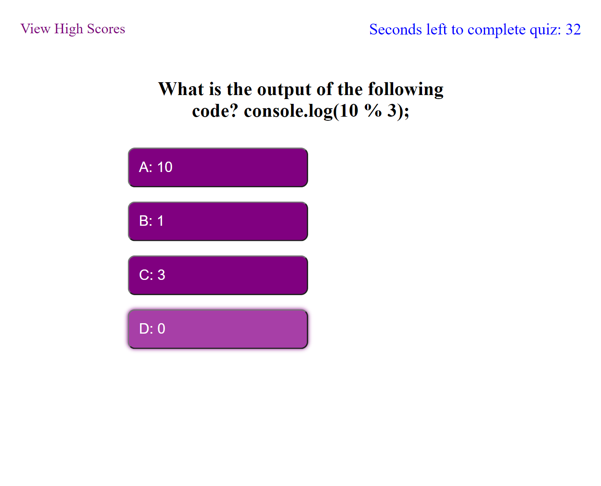

# Code Quiz: Module 4 Challenge

## Description

The goal of this project was to build a web app that functions as a timed coding quiz. It features dynamically updated HTML and CSS powered by JavaScript. 

## Finished Project

### Comments

* Upon loading the initial page, there is a link to view other user's high scores, a code-quiz title and welcome message, and a button that when clicked starts the questionaire and a countdown timer.
* Once the quiz begins, the user has 60 seconds to complete the quiz, and the remaining time as it counts down is displayed on-screen. If a correct answer is chosen, the user's score is increased and a message of 'Correct!' is displayed on screen. If an incorrect answer is chosen, the timer countdown has 15 seconds subtracted and a 'Wrong!' message ,as well as which answer was correct, is displayed on-screen.
* Once the user reaches the end of the quiz, they will be prompted to enter their name in a text field, which will add their name to a leaderboard of high scores. They can then click the button provided to start the quiz from the beginning and try again.
* If the countdown timer reaches zero, the quiz ends and a `Sorry you ran out of time` message is displayed, as well as a button to start the quiz from the beginning.
* The app is also responsive, making it possible to take the quiz on a smaller screen such as a phone.

### Deployed Website

[ Click Here to View Depoloyed Website](https://newprice247.github.io/Code-Quiz-Mod-4/)

)

## Contact Me

[Nathaniel Price](https://github.com/newprice247) @ Github
